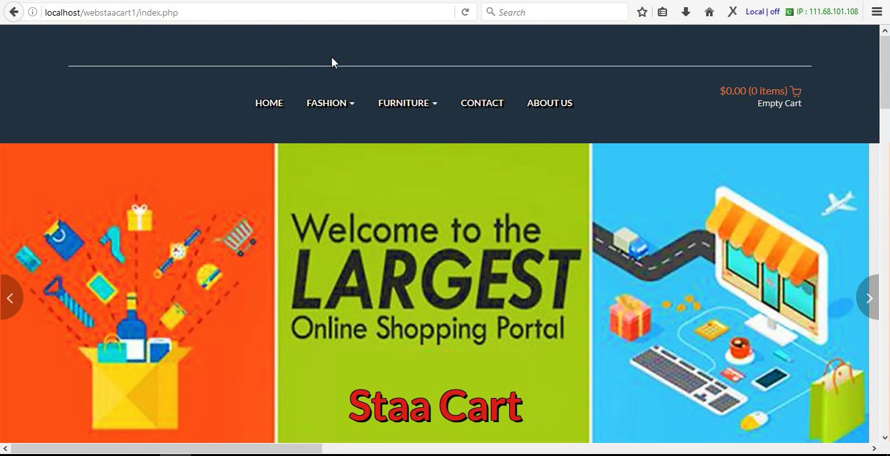
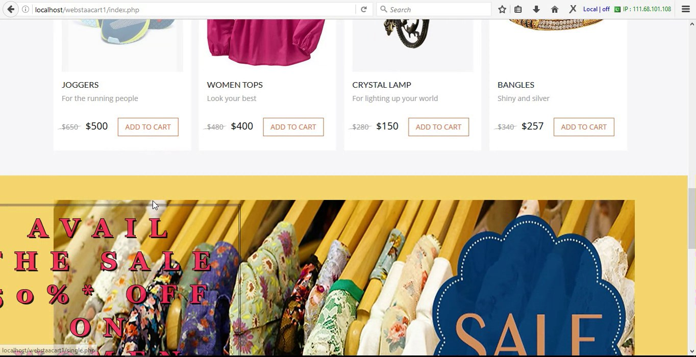
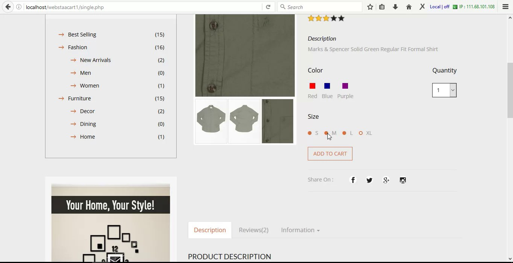
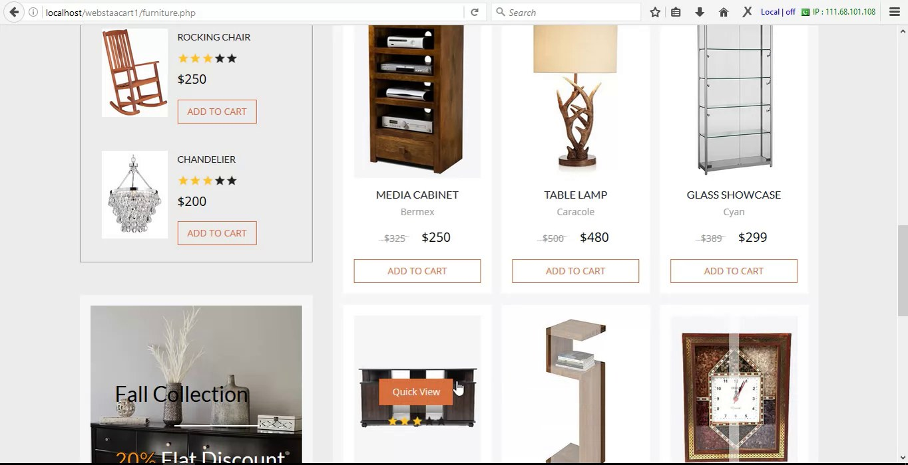
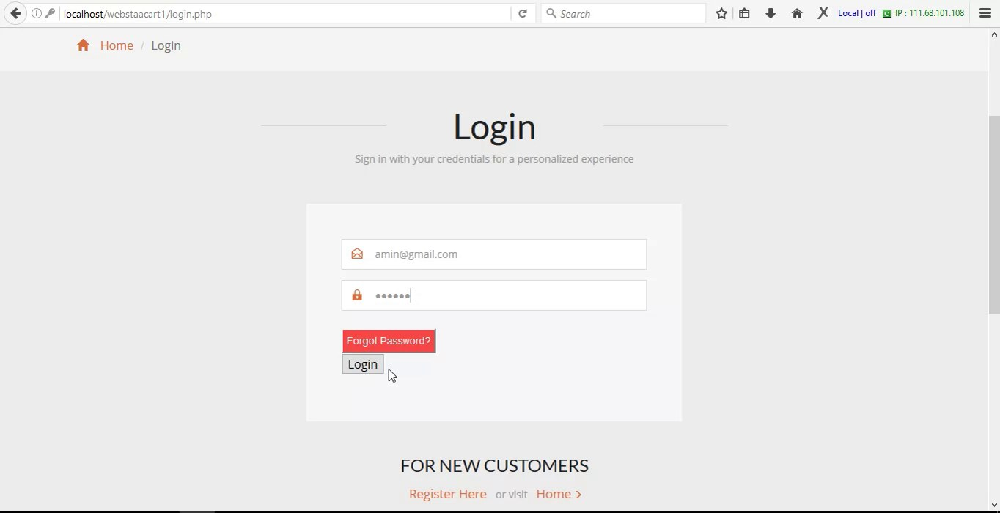
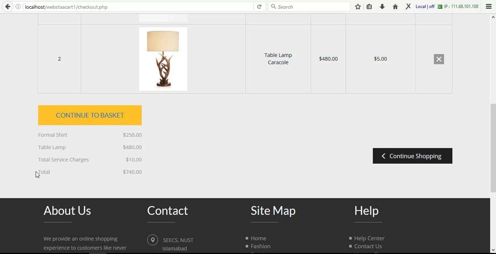

# StaaCart

A fully responsive online shopping web app for fashion and furniture. I built StaaCart as a full-stack web project: shoppers can register and sign in, browse the men's, women's and kids' fashion catalogs and a separate furniture catalog, open a single product page, add items to a cart, and run through a checkout flow — all backed by PHP and MySQL with a responsive Bootstrap front end.

## Tech stack

- **Back end:** PHP (with the `mysqli` driver and prepared statements)
- **Database:** MySQL
- **Front end:** HTML5, CSS3, Bootstrap 3, JavaScript
- **JavaScript libraries:** jQuery, simpleCart.js (client-side cart), FlexSlider, ResponsiveSlides, jQuery Countdown, WOW.js + Animate.css
- **Fonts:** Google Fonts (Open Sans, Lato)

## Features

- **User accounts** — registration with name/email/password validation, and session-based login. Passwords are stored as salted bcrypt hashes (`password_hash` / `password_verify`).
- **Fashion catalog** (`products.php`) — men's, women's and kids' wear organized through a mega-menu.
- **Furniture catalog** (`furniture.php`) — a separate storefront for home and furniture items.
- **Single product view** (`single.php`) — a detailed product page with image zoom.
- **Shopping cart** — a client-side cart powered by simpleCart.js, with a checkout page (`checkout.php`).
- **Contact page** (`mail.php`) — contact details with an embedded Google Map.
- **Team page** (`team.php`) — the people behind the project.
- **Responsive design** — adapts from desktop down to mobile, with slider and animation effects throughout.

## Screenshots

| Home | Fashion catalog |
|------|-----------------|
|  |  |

| Product detail | Furniture catalog |
|----------------|-------------------|
|  |  |

| Login | Checkout |
|-------|----------|
|  |  |

## Prerequisites

- PHP 7.0 or newer (works on PHP 8) with the `mysqli` extension enabled
- MySQL (or MariaDB)
- A web server that runs PHP — the simplest path is an all-in-one stack like [XAMPP](https://www.apachefriends.org/)

## Getting started

1. **Clone the project** into your web server's document root (for XAMPP that's `htdocs/`):

   ```bash
   git clone https://github.com/faizanzafar40/StaaCart.git
   ```

2. **Create the database and table.** Create a database named `webstaacart1` and import the schema:

   ```sql
   CREATE DATABASE webstaacart1;
   USE webstaacart1;
   SOURCE sql/schema.sql;
   ```

   Or from the command line:

   ```bash
   mysql -u root -p -e "CREATE DATABASE webstaacart1"
   mysql -u root -p webstaacart1 < sql/schema.sql
   ```

3. **Configure the database connection.** By default the app connects as `root` with no password to `webstaacart1` on `localhost`, which matches a stock XAMPP setup. To use different credentials, set the `DB_HOST`, `DB_USER`, `DB_PASS` and `DB_NAME` environment variables (see [`.env.example`](.env.example)) — `dbconnect.php` reads them and falls back to the local defaults when they aren't set.

4. **Run it.** Start Apache and MySQL, then open the app in your browser:

   ```
   http://localhost/StaaCart/index.php
   ```

   Register a new account, sign in, and start browsing.

## Tests

This project doesn't have an automated test suite — I verify it by running it locally and walking through the register → login → browse → cart → checkout flow in the browser.

## Project structure

```
.
├── index.php          # Home page
├── products.php       # Fashion catalog
├── furniture.php      # Furniture catalog
├── single.php         # Single product detail page
├── checkout.php       # Checkout page
├── login.php          # Sign in
├── register.php       # Create an account
├── logout.php         # End the session
├── mail.php           # Contact page
├── team.php           # Team page
├── dbconnect.php      # Shared MySQL connection (mysqli)
├── sql/
│   └── schema.sql     # Database schema (users table)
├── css/               # Bootstrap, theme and plugin stylesheets
├── js/                # jQuery, simpleCart and other plugins
├── fonts/             # Glyphicon web fonts
├── images/            # Product imagery, icons and screenshots
├── .env.example       # Sample database environment variables
└── LICENSE
```

## Context / what I learned

I built StaaCart as a web engineering project at NUST-SEECS. It was where I first put a full LAMP-style stack together end to end — designing the MySQL schema, wiring up PHP for authentication and database access, and building a responsive multi-page storefront on top of Bootstrap and jQuery. Working through sessions, form validation, prepared statements and a client-side cart taught me how the front end, back end and database fit together in a real web app.

## License

This project is licensed under the MIT License — see the [LICENSE](LICENSE) file for details.
